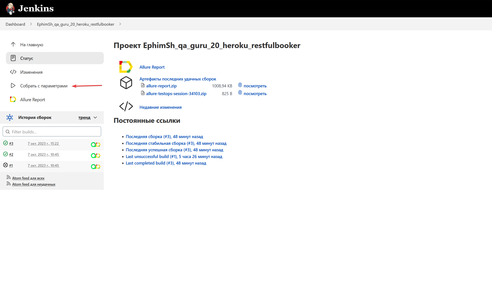
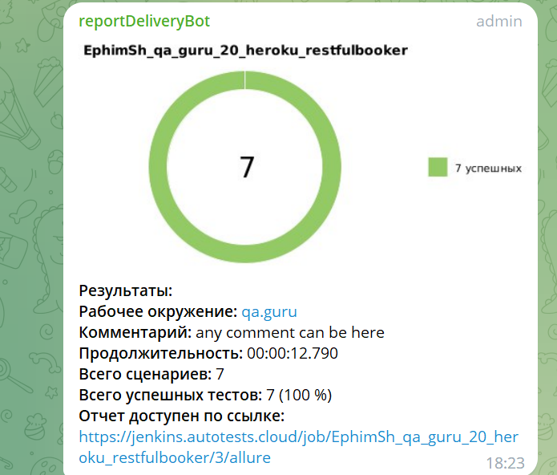
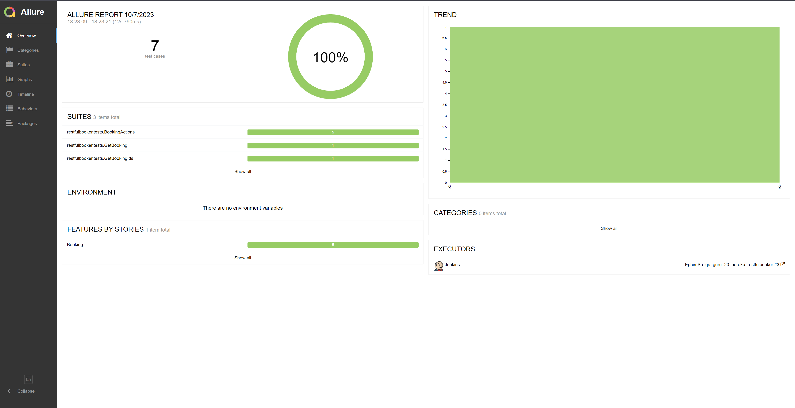
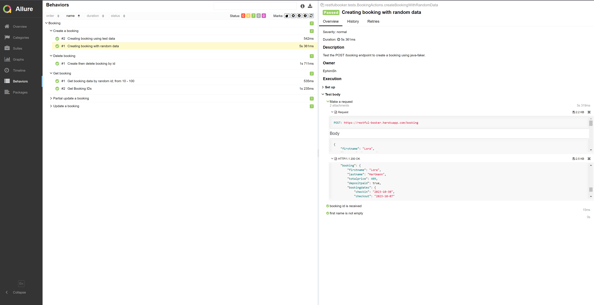
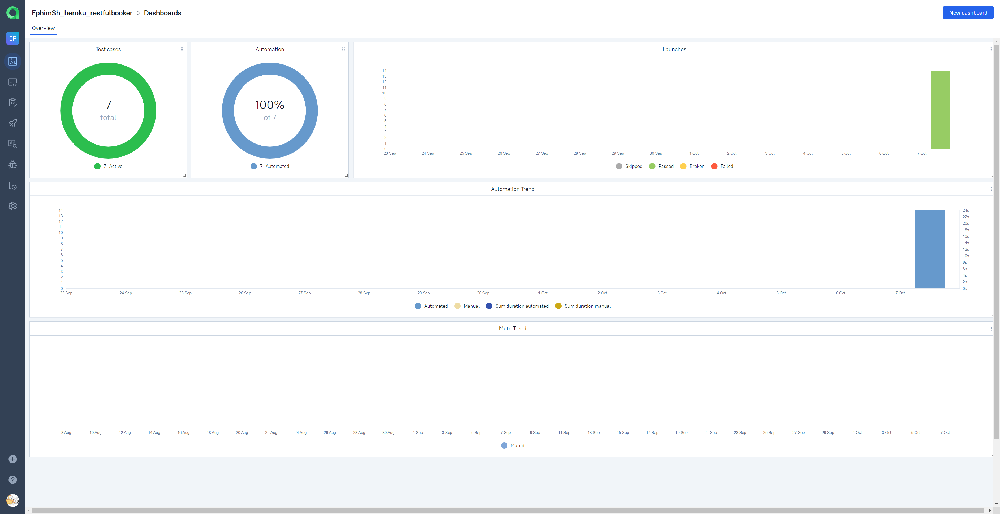
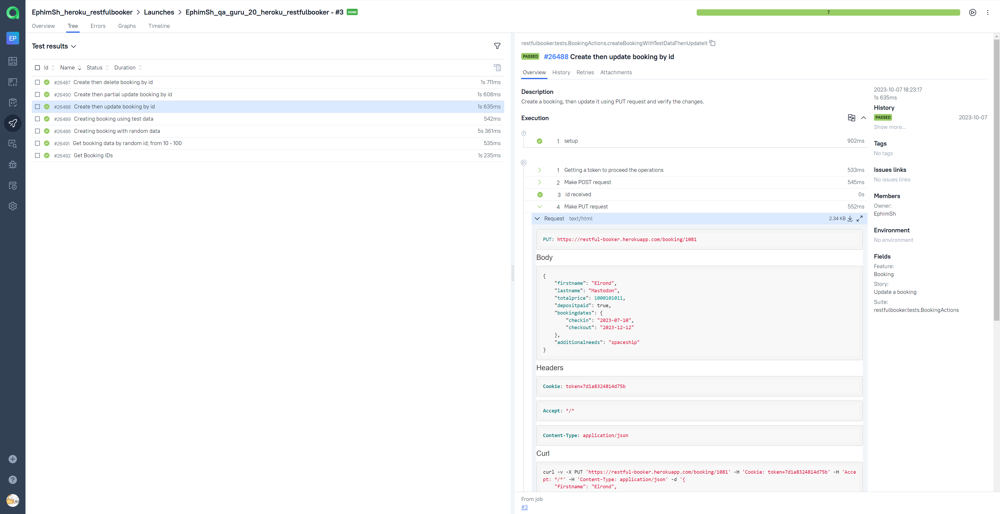
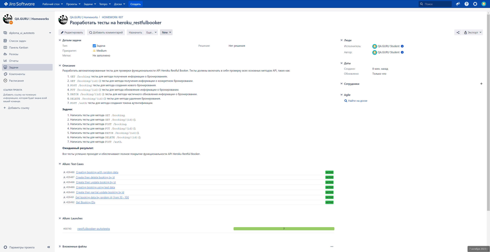

# heroku_restfulbooker_tests

<h1 >Демопроект автоматизации тестирования API на <a href="https://restful-booker.herokuapp.com/apidoc/index.html">restful-booker</a></h1>

##  Содержание 

* <a href="#tools">Технологии и инструменты</a>

* <a href="#console">Запуск тестов из терминала</a>

* <a href="#jenkins">Запуск тестов в Jenkins</a>

* <a href="#telegram">Уведомления в Telegram</a>

* <a href="#allure">Allure Report отчеты</a>

* <a href="#allure-testops">Интеграция с Allure TestOps</a>

* <a href="#jira">Интеграция с Jira</a>


<a id="tools"></a>
## Технологии и инструменты

| Java | IntelliJ Idea | Allure | Allure TestOps | GitHub | JUnit 5 | Gradle | REST Assured | Jenkins | Jira |
| ---- | ------------- | ------ | ------------- | ------ | -------| ------ | ------------| --------| ----- |
| <a href="https://www.java.com/"></a> | <div align="center"><a id ="tech" href="https://www.jetbrains.com/idea/"></a></div> | <a href="https://github.com/allure-framework"></a> | <div align="center"><a href="https://qameta.io/"></a></div> | <a href="https://github.com/"></a> | <a href="https://junit.org/junit5/"></a> | <a href="https://gradle.org/"></a> | <div align="center"><a href="https://rest-assured.io/"></a></div>  |   <a href="https://www.jenkins.io/"></a> | <a href="https://www.atlassian.com/ru/software/jira"></a> |


Автотесты в этом проекте написаны на Java .\
<code>Gradle</code> — используется как инструмент автоматизации сборки.\
<code>JUnit5</code> — для выполнения тестов.\
<code>REST Assured</code> — для тестирования REST-API сервисов.\
<code>Allure Report</code> — для визуализации результатов тестирования.\
<code>Allure TestOps</code> — как система управления тестированием.\
<code>Jira</code> — как инструмент управления проектом и таск-трекер.\
<code>Telegram Bot</code> — для уведомлений о результатах тестирования.


<a id="console"></a>

***Удалённый запуск реализован через сборку в  Jenkins:***

```bash  
clean test
```

<a id="jenkins"></a>
## </a> Запуск тестов в [Jenkins](https://jenkins.autotests.cloud/job/EphimSh_qa_guru_20_heroku_restfulbooker/)

<p align="center">

> Для запуска необходимо нажать "Собрать с параметрами".

<a href="https://jenkins.autotests.cloud/job/AD_demo_api_reqres/"></a>

<a id="telegram"></a>
## </a> Уведомления в Telegram

<p >

> С помощью настроенного бота после завершения прогона в Jenkins поступают уведомления в Telegram.


</p>

<a id="allure"></a>
## </a> [Allure Report](https://jenkins.autotests.cloud/job/EphimSh_qa_guru_20_heroku_restfulbooker/allure/) отчеты
### Основное окно

<p align="center">

</p>

### Отчеты по тестам

<p align="center">

> В отчете по тестам присутствует развернутая информация по запросам и ответам.


</p>

<a id="allure-testops"></a>
## </a> Интеграция с [Allure TestOps](https://allure.autotests.cloud/launch/30743)

### Основное окно

<p align="center">

</p>

### Иерархия тестов в ветке

<p align="center">

</p>

<a id="jira"></a>
## </a> Интеграция с [Jira](https://jira.autotests.cloud/browse/HOMEWORK-907)

<p align="center">

</p>
